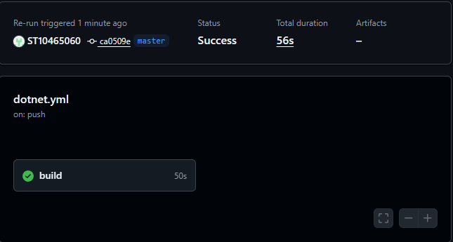
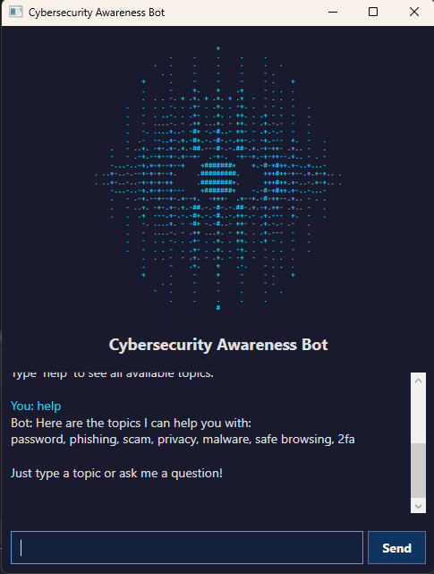

# PROG6221 POE - Cybersecurity Awareness ChatBot

A WPF-based cybersecurity awareness chatbot built in C# with .NET 6.0. The bot educates users about online safety topics like phishing, password hygiene, and privacy, adapts its tone based on how the user is feeling, and now includes task management, a quiz game, NLP simulation, and activity logging.

## Student Information
- **Name:** Eduan Pretorius
- **Student Number:** ST10465060
- **Module:** PROG6221 - Programming 2A
- **Assessment:** Portfolio of Evidence (POE) - Part 3

## What's New in Part 3

Part 3 builds on the WPF chatbot from Part 2 and adds the following features:

- **MySQL Task Assistant** — create, view, complete, and delete cybersecurity tasks stored in a MySQL database. Tasks support optional reminder dates.
- **Reminder System** — a background timer checks for upcoming task deadlines and notifies you inside the chat.
- **Cybersecurity Quiz** — a 12-question multiple-choice mini game to test your cybersecurity knowledge, with scoring and feedback.
- **NLP Simulation** — the bot now detects user intent (e.g. adding a task, starting a quiz, viewing logs) using basic natural language processing instead of relying only on exact keywords.
- **Activity Log** — all bot actions are recorded to a log file (`activity_log.txt`) so you can review what happened during a session.
- **Quick Action Buttons** — GUI buttons for Tasks, Quiz, Activity Log, and Help for easier navigation.

## Previous Parts

### Part 1 (Console App)
- Basic console chatbot with ASCII art, audio greeting, and keyword-based responses.

### Part 2 (WPF GUI)
- WPF dark-themed interface with scrollable chat area.
- Voice greeting and ASCII art on startup.
- Keyword recognition for 5+ cybersecurity topics with random responses.
- Sentiment detection (worried, curious, frustrated, happy) with empathetic replies.
- Memory and recall — bot remembers your name and favourite topic.
- Conversation flow — "tell me more" continues the current topic.

## Project Structure

```
PROG6221w-POE_CyberSecurityChatBot/
├── .github/
│ └── workflows/
│ └── dotnet.yml
├── CyberSecurityChatBotGUI/ ← Part 2 + Part 3 (WPF)
│ ├── Assets/
│ │ ├── ascii-art.txt
│ │ └── Recording.wav
│ ├── ActivityLogger.cs ← Part 3
│ ├── App.xaml
│ ├── App.xaml.cs
│ ├── AssemblyInfo.cs
│ ├── ChatBot.cs ← Updated in Part 3
│ ├── CyberSecurityChatBotGUI.csproj
│ ├── DatabaseHelper.cs ← Part 3
│ ├── KeywordResponder.cs
│ ├── MainWindow.xaml ← Updated in Part 3
│ ├── MainWindow.xaml.cs ← Updated in Part 3
│ ├── MemoryStore.cs
│ ├── NlpProcessor.cs ← Part 3
│ ├── QuizGame.cs ← Part 3
│ ├── SentimentDetector.cs
│ └── TaskItem.cs ← Part 3
├── PROG6221w-POE_CyberSecurityChatBot/ ← Part 1 (Console)
│ ├── Assets/
│ ├── AudioPlayer.cs
│ ├── ChatBot.cs
│ ├── PROG6221w-POE_CyberSecurityChatBot.csproj
│ ├── Program.cs
│ └── User.cs
├── .gitattributes
├── .gitignore
├── PROG6221w-POE_CyberSecurityChatBot.slnx
└── README.md
```
## Database Setup

The task assistant requires a MySQL database. Follow these steps before running the app:

1. Install **MySQL Server** and **MySQL Workbench** from [mysql.com](https://dev.mysql.com/downloads/installer/).
2. Open MySQL Workbench and connect to your local server.
3. Run the following SQL script to create the database and table:

```sql
CREATE DATABASE IF NOT EXISTS cybersecurity_chatbot;

USE cybersecurity_chatbot;

CREATE TABLE tasks (
    Id INT AUTO_INCREMENT PRIMARY KEY,
    Title VARCHAR(200) NOT NULL,
    Description TEXT,
    ReminderDate DATETIME NULL,
    IsCompleted TINYINT(1) DEFAULT 0,
    CreatedAt DATETIME DEFAULT CURRENT_TIMESTAMP
);
```
Update the connection string in DatabaseHelper.cs with your MySQL credentials:

```csharp
_connectionString = "Server=localhost;Port=3306;Database=cybersecurity_chatbot;Uid=root;Pwd=YOUR_PASSWORD;SslMode=Preferred;AllowPublicKeyRetrieval=True;";
```
Note: Replace YOUR_USERNAME and YOUR_PASSWORD with the credentials you set during MySQL installation (default username is usually root).

## How to Run

1. Clone the repository or extract the ZIP file.
2. Set up the MySQL database using the steps above.
3. Open PROG6221w-POE_CyberSecurityChatBot.slnx in Visual Studio 2022.
4. In Solution Explorer, right-click CyberSecurityChatBotGUI and select Set as Startup Project.
5. Make sure the Recording.wav and ascii-art.txt files are in the Assets folder and set to Copy Always.
6. Press F5 to build and run.

## Prerequisites

- Visual Studio 2022
- .NET 6.0 SDK
- MySQL Server 8.0+
- MySQL Workbench (for database setup)
- Windows OS (WPF is Windows-only)

## NuGet Packages

- MySql.Data — MySQL database connectivity

## Technologies Used

- C# / .NET 6.0
- WPF (Windows Presentation Foundation)
- MySQL (database)
- System.Media.SoundPlayer

## CI/CD



## Application Screenshot



## Video Presentation

Part 2 - https://www.youtube.com/watch?v=i3eLU4S2OLw
Part 3 - 

## Releases

- **v2.0** — Part 2 initial release with WPF GUI, keyword recognition, and random responses.
- **v2.1** — Added sentiment detection, memory and recall, and conversation flow.
- **v3.0** — Core Part 3 features: MySQL integration, TaskItem model, ActivityLogger, and quiz game.
- **v3.1** — NLP simulation with intent detection and input parsing.
- **v3.2** — Final Part 3 release with full GUI integration, quick action buttons, and reminder system.
